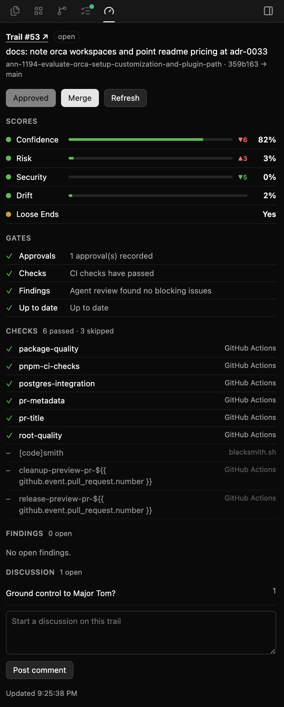

# Entire Trails for Orca

An [Orca](https://github.com/stablyai/orca) side panel for [Entire](https://entire.io) Trails. It
follows the worktree you have focused and shows that branch's open trail: runner scores and how
they changed, gates, CI checks, findings, and discussion. You can approve, merge, comment, open the
trail, or ask your coding agent to work on a score without leaving Orca.



It drives the `entire` and `gh` CLIs you already use. Nothing talks to Entire or GitHub except
those CLIs.

## What the panel shows

- **Header:** trail number (click it to open the trail in your browser), status, title, branch,
  and head commit.
- **Scores:** Confidence, Risk, Security, Drift, and Loose Ends, updated live as runners report.
  - A badge shows the change since the previous scored commit, green when it moved the right way.
  - Open a score to read the runner's explanation and its history by commit.
  - Scores that can still improve get a button for each agent tab in the worktree, for example
    **Lower this with Claude · Codex**, which sends that agent a one-line prompt to work on it.
- **Gates, Checks, Findings:** the trail's gates, every CI check run (failures first), and open
  agent findings with file and line.
- **Discussion:** open threads first, with messages and replies, plus a box to start a new one.
- **Actions:** **Approve** and **Merge** (both need two clicks) and **Refresh**.

## Requirements

- macOS and Orca 1.4.219 or later.
- [`entire`](https://entire.io) installed and signed in (`entire auth status`), in a repository with
  Entire Trails.
- [`gh`](https://cli.github.com) signed in (`gh auth status`). Merge uses it.

The worker looks for these CLIs in `~/.local/bin`, `/opt/homebrew/bin`, `/usr/local/bin`, then
Orca's `PATH`.

## Set it up

1. Clone the repository somewhere it can stay:

   ```sh
   git clone https://github.com/wiseiodev/orca-entire-trails.git ~/dev/orca-entire-trails
   cd ~/dev/orca-entire-trails
   git update-index --skip-worktree panel.html
   ```

   The worker rewrites `panel.html` on every update. The last command keeps that out of
   `git status`.

2. In Orca, open **Settings → Plugins** and turn on **Plugin system**.

3. Open **Development**, add the folder you cloned, and approve the plugin. It asks for:
   - **Read the focused worktree** to know which branch's trail to show.
   - **Type into a terminal** for the buttons (see [How the buttons work](#how-the-buttons-work)).
   - **Plugin storage** to remember the terminal tab it uses in each worktree.
   - **Worktree and agent events** to start up and to notice new agent tabs.

   Add it under **Development**. Installing it from a path, git, or a marketplace makes Orca copy
   and hash-lock it, and the panel then never updates.

4. Click the gauge icon in the right sidebar to open the **Entire Trail** panel.

The worker starts on the next agent or worktree event. To start it right away, run
**Entire Trails: Refresh** from the command palette.

### Updating

```sh
cd ~/dev/orca-entire-trails && git pull
```

Orca restarts a development plugin's worker only when `orca-plugin.json` changes. Releases bump
its version, so a pull is enough. If you edit `main.mjs` yourself, turn the plugin off and on in
**Settings → Plugins**.

## How the buttons work

Orca panels run in a sandbox. They can't run commands, make network requests, or open windows;
they can only type into a terminal in the focused worktree. So the worker opens one terminal tab
per worktree with an open trail, and each button types its command there, where you can see it run:

| Button | Runs |
| --- | --- |
| Trail number | `open '<trail url>'` |
| Approve | `entire trail approve <n>` |
| Merge | `gh pr merge --<method>` |
| Post comment | `entire trail comment add --trail <n> -m $'…'` |
| Refresh | `touch ~/.cache/orca-entire-trails/refresh` |

- **Merge** uses the repository's preferred allowed method (squash, then merge, then rebase). It
  is enabled only when every gate has passed and Entire reports the trail mergeable with no
  conflicts; hover it to see what it is waiting on. The Entire CLI has no merge command, so this
  merges the GitHub PR directly. It leaves branch deletion to GitHub, because the worktree still
  has the branch checked out.
- **Refresh** touches a file the worker watches, then the worker re-reads everything and replays the
  score stream. Approve and Post comment refresh the same way when they succeed.
- **Agent buttons** type straight into that agent's tab and press Enter. The prompt is one line,
  because a newline would submit early, and it marks the runner's notes as evidence rather than
  instructions.

## How it works

Orca's plugin API (`pluginApi: 1`) gives panels no way to receive data from their worker
([stablyai/orca#15638](https://github.com/stablyai/orca/issues/15638)). This plugin works around
that: the worker rewrites `panel.html` whenever something changes, and Orca reloads development
plugin panels when their files change.

- The worker checks the focused worktree every second, finds its folder with
  `orca worktree show`, and reads the trail with `entire trail show`, `entire trail finding`, and
  `entire trail comment`.
- Scores and their history come from `entire trail watch --json`, which replays every past score
  and then streams new ones.
- Discussions emit no watch events, so they are re-checked every minute.

Known limits:

- It works only as a development plugin (see step 3).
- Each update reloads the panel, which resets its scroll position, open rows, and any comment you
  were typing. Updates bunch up right after a push, so write long comments once CI settles.
- The worker runs `entire` and `gh` as child processes. Orca has no exec permission for plugins yet
  ([stablyai/orca#18214](https://github.com/stablyai/orca/issues/18214)); if it adds one, the
  manifest will need to declare it.
- Trails attach to a branch on its first push and detach when the PR merges, so the panel shows only
  open trails.
- Score colors are this plugin's thresholds, not Entire's: green at 80 or better (after flipping
  "lower is better" scores), amber from 50, red below.

## Troubleshooting

- **"Waiting for Entire…" never changes:** check the plugin is listed under **Development** and not
  as an installed copy, then run **Entire Trails: Refresh** from the command palette.
- **"No open Entire trail":** the branch hasn't been pushed, has no trail, or its PR has merged.
- **No buttons:** the worker couldn't open its terminal tab. Run Refresh; it opens a new tab if the
  old one was closed.
- **"Couldn't read the trail":** the panel shows the `entire` error. Check `entire auth status` in a
  terminal.

## Develop

No dependencies. `main.mjs` is the worker, `render.mjs` builds the panel, and `orca-plugin.json` is
the manifest.

```sh
npm test
```

## License

[MIT](LICENSE)
